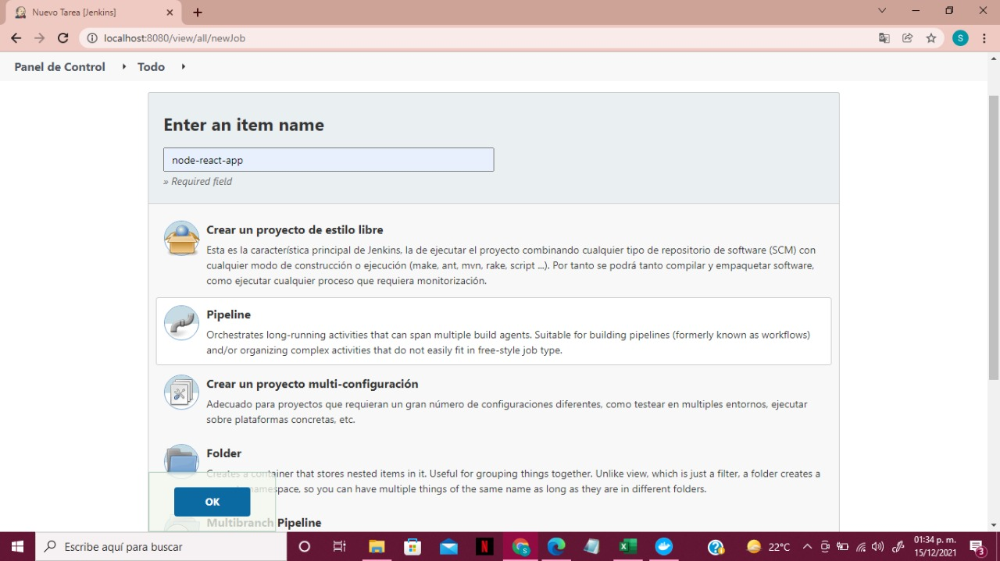
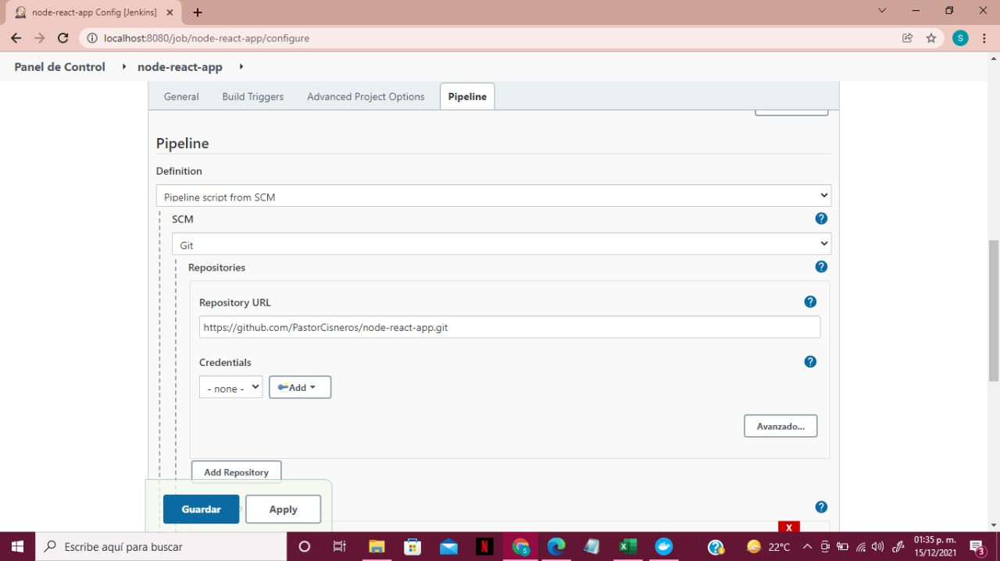

# Configuracion REACt-NODE


## Implementacion de CD/CI

Creacion de dockerfile y yaml para k8s

``` Dockerfile
FROM node:lts-alpine3.14

WORKDIR /app-cd

COPY app/ .

RUN npm install

ENV PORT=8084

ENTRYPOINT [ "npm", "start"]
```

``` yaml

apiVersion: v1
kind: Service
metadata:
  name: app-cd
spec:
  type: LoadBalancer
  selector:
    app: cd
  ports:
    - port: 8084
      targetPort: 8084
---
apiVersion: apps/v1
kind: Deployment
metadata:
  name: app-cd
spec:
  replicas: 3
  selector:
    matchLabels:
      app: cd
  template:
    metadata:
      labels:
        app: cd
      name: app-cd
    spec:
      containers:
        - name: app-cd
          image: pas_a/app-cd
          resources:
            limits:
              cpu: "100m"
              memory: "256Mi"
            requests:
              cpu: "100m"
              memory: "256Mi"
          ports:
            - containerPort: 8084

```


Se registra el elemento en jenkins







